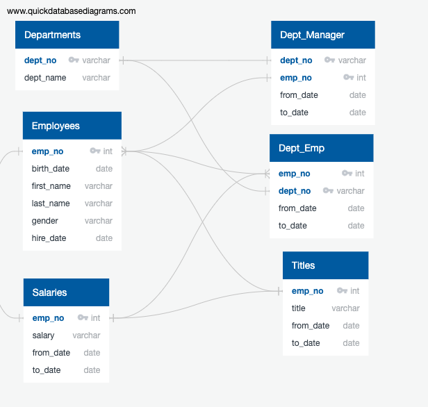
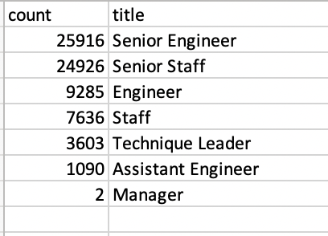
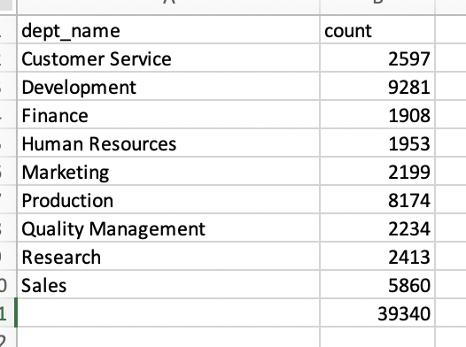
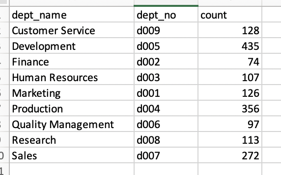
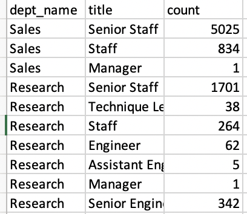
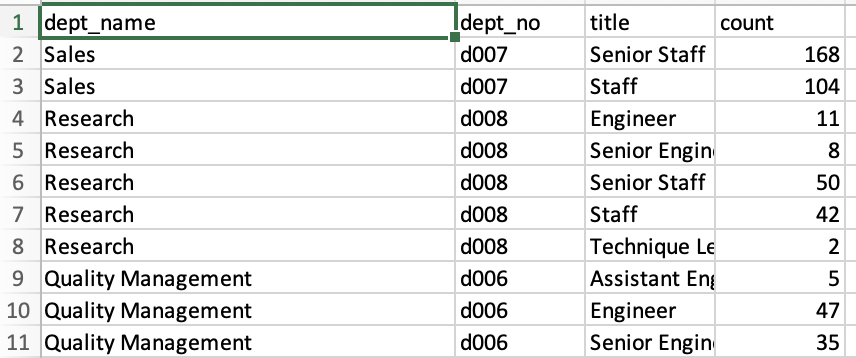

# Pewlett Hackard Analysis with SQL 

## Overview of the Analysis 
Pewlett Hackard is a large company boasting several thousand employees and it has been around for a long time. As baby boomers beginning to retire at a rapid rate, the number of upcoming retirements will leave thousands of job openings. 

Bobby is an up and coming HR analyst whose task is to perform employee research. Specficially, he needed to find answers to the following questions 
* Who will be retiring in the next few years? 
* How many positions will Pewlett Hackard need to fill? 

In the initial analysis, Bobby has asked for help in finding the answers to the above questions using SQL.

The employee data used in the initial analysis were in the form of six CSV files. The Quick Database Diagram tool was used to create an entity relationship diagram to highlight the relationships between the data in each csv file. Primary and Foreign keys were identified. The ERD created is shown below. 

The CSV files were then imported into tables that were created within pgAdmin. For information on this please see the [schema](schema.sql) sql file. 

Then queries were created to create additional tables to help address the questions noted above which were then exported to csv files. For more information on how the tables were created, please see the [queries](Queries/queries.sql). 

The CSV files created for the initial analysis were:
* [dept_info](Data/dept_info.csv)
* [emp_info](Data/emp_info.csv)
* [manager_info](Data/manager_info.csv)
* [retirement_by_dept](Data/retirement_by_dept.csv)
* [retirement_info](Data/retirement_info.csv)
* [sales_and_dev_emp](Data/sales_and_dev_emp.csv)
* [sales_emp](Data/sales_emp.csv)

Now Bobby's manager has asked for two more assignments: determine the number of retiring employees per title, and identify employees who are eligible to participate in a mentorship program. 

## Resources and Systems
Systems used:
* pgAdmin
* Postgres SQL
* Visual Studio Code

Six CSV files were used in the initial and current analysis: 
* [departments](Data/departments.csv)
* [employees](Data/employees.csv)
* [salaries](Data/salaries.csv)
* [dept_manager](Data/dept_manager.csv)
* [dept_emp](Data/dept_emp.csv)
* [titles](Data/titles.csv)

## Analysis Process 
### The Number of Retiring Employees by Title
Using the ERD shown above as a reference, a Retirement Titles table was created that holds all the titles of employees who were born between January 1, 1952 and December 31, 1955. Because some employees may have multiple titles in the database—for example, due to promotions— the DISTINCT ON statement was used to create a table that contains the most recent title of each employee. Then, the COUNT() function was used to create a table that has the number of retirement-age employees by most recent job title. Finally, to include only current employees in the analysis, employees who have already left the company were excluded. 

For information on how this was done, please see the [Employee_Database_challenge](Employee_Database_challenge.sql) sql file. 

The tables were exported into the following csv files: 
* [retirement_titles](Data/retirement_titles.csv)
* [unique_titles](Data/unique_titles.csv)
* [retiring_titles](Data/retiring_titles.csv)

### The Employees Eligible for the Mentorship Program
Using the ERD shown above as a reference, a mentorship-eligibility table was created that holds the current employees who were born between January 1, 1965 and December 31, 1965.

For information on how this was done, please see the [Employee_Database_challenge](Employee_Database_challenge.sql) sql file. 

The table was exported into the following csv file: 
* [mentorship_eligibility](Data/mentorship_eligibility.csv)

## Results 
* Within the retirement titles table ([retirement_titles](Data/retirement_titles.csv)), while a list of retiring employees and their titles were extracted, there were duplicate entries for some employees because they have switched titles over the years. 

* Within the unique titles table ( [unique_titles](Data/unique_titles.csv)), the duplicates were removed so that the most recent title of each employee was shown. 

* Then, to retrieve the count of employees by their most recent job title, who was about to retire, the retiring table ([retiring_titles](Data/retiring_titles.csv)), was created. Below is an image of the results of the retiring titles table.

* Within the mentorship eligibility table ([mentorship_eligibility](Data/mentorship_eligibility.csv)) current employees first name, last name, employee number, birth date, from date, to date and title were extracted who were born in 1965 to show who may be eligible to be a mentor. 

From the above four major observations can be made: 
* there are 7 roles that will need to be filled: Senior Engineer, Senior Staff, Engineer, Staff, Technique Leader, Assistant Engineer and Manager 

* Pewlett Hackard should expect 72,458 employees to retire within these 7 roles. 

* Majority of roles to be filled are in the Senior Engineer and Senior Staff positions. Senior engineer positions account for 36% of expected retirees' positions, senior staff accounts for 34%, engineer accounts for 13%, staff accounts for 11%, technique leader accounts for 5%, assistant engineer accounts for 2% and manager accounts for 0.003%. 

* There are 1,549 eligible mentors within the following roles: Engineer (403 employees), Assistant Engineer (53 employees), Senior Staff (422 employees), Staff (402 employees), Senior Engineer (292 employees) and Technique Leader (77 employees). However this is likely not enough to mentor the next generation of employees considering there are 72,458 positions to be filled. Each mentor would need to take on about 47 employees each to be mentored, which is not feasible. 

* Although there are only 2 managers expected to retire, there are no eligible mentors for this role. 

## Summary 

### How many roles will need to be filled as the "silver tsunami" begins to make an impact?

There are 7 roles that will need to be filled as the "silver tsunami" begins to make an impact. This includes: Senior Engineer, Senior Staff, Engineer, Staff, Technique Leader, Assistant Engineer and Manager. Specifically:
* 25,916 Senior Engineer roles will need to be filled 
* 24,926 Senir Staff roles will need to be filled 
* 9,285 Engineer roles will need to be filled
* 7,636 Staff roles will need to be filled
* 3,603 Technique Leader roles will need to be filled
* 1,090 Assistant Engineer roles will need to be filled
* 2 Manager roles will need to be filled

### Are there enough qualified, retirement-ready employees in the departments to mentor the next generation of Pewlett Hackard employees?
To answer this question, 2 additional queries were run to determine if there were enough qualified mentors to mentor employees who would be filling in the roles of those retiring. 

For details on these additional queries, please see the [Employee_Database_challenge](Employee_Database_challenge.sql) sql file. 

The first query ran was to determine the count of employees retiring in each department. This is shown below and can also be found in the [dept_retiring](dept_retiring.csv) CSV file. 

The second query ran was to determine the departments of those who are eligible to be mentors, which is shown below. This is shown below and can also be found in the [dept_mentors](dept_mentors.csv) CSV file. 

From the images above, it can be seen that there are not enough eligible mentors to mentor those who will be filling in the roles of the employees retiring in each department. There are thousands more people retiring than there are mentors, mentors would need to mentor about 15 - 20 employees each to which is not feasible. This also brought to light that some employees which are retiring are not assigned to a department. 

To further help Bobby and his manager and provide more detail, I have created two additional queries which breaks up the count of unique titles in each department for those that are retiring, as well the titles of eligible mentors in each department. These can be found in the following two files: 

* [dept_retirement_titles](Data/dept_retirement_titles.csv) 
* [dept_mentors_titles](dept_mentors_titles.csv) 

Below is the first 10 rows of each file. 

Retiring Employees Titles by Department:

Eligible Mentors Titles by Department:

This information can help address specifically where more mentorship resources are needed in each department for different roles. For example, in the images above there is someone in the Sales department who is a manager who is retiring. However, there is no one in Sales who is currently a manager that is eligible to be a mentor. As a suggestion, perhaps Pewlette Hackard can broaden the scope of mentorship eligibility (instead of just those being born in 1965).  
